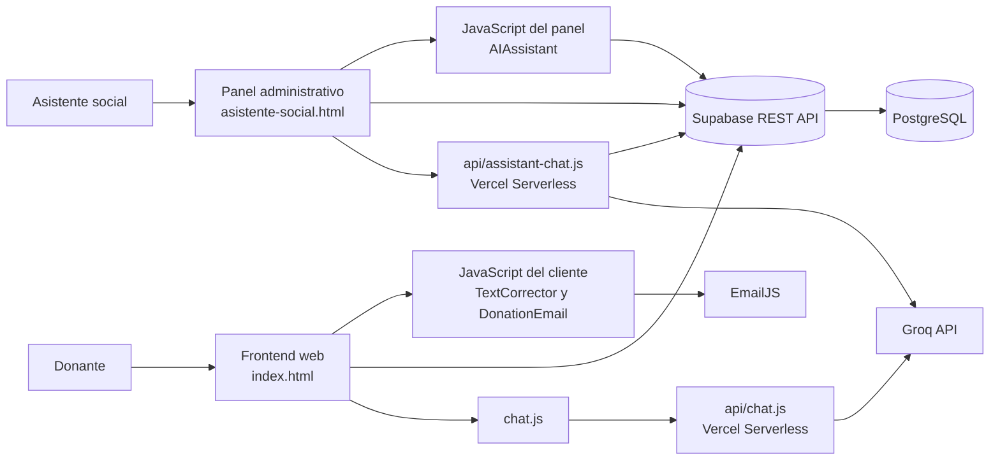

# Manual técnico - Manos Conectadas

## 1. Introducción

### 1.1. Objetivo del manual

El objetivo de este manual es explicar la estructura técnica, la instalación, la configuración, el funcionamiento y el mantenimiento de **Manos Conectadas**. El documento sirve como guía para poner en marcha el sistema, comprender la relación entre sus componentes y resolver los problemas más frecuentes durante el desarrollo o el despliegue.

El manual también establece criterios para trabajar con la base de datos, las funciones serverless, los servicios externos y las variables de entorno. De esta manera, una persona técnica puede continuar el proyecto sin depender exclusivamente de quienes participaron en su implementación inicial.

### 1.2. Propósito del sistema

Manos Conectadas es una plataforma web para registrar, organizar y dar seguimiento a donaciones solidarias. El sistema permite que una persona cargue una donación, indique sus características, adjunte fotografías y defina si la entrega se realizará directamente o si necesita coordinación para el retiro.

La plataforma asigna un código de seguimiento a cada donación y conserva información sobre el donante, los objetos ofrecidos, la coordinación, las fotografías, las respuestas y el estado del proceso. Además, incluye un panel para la asistente social, herramientas de priorización y asistentes basados en inteligencia artificial para consultar y analizar la información.

El sistema integra los siguientes componentes:

- Formulario público para registrar donaciones.
- Panel administrativo para asistentes sociales.
- Base de datos PostgreSQL administrada mediante Supabase.
- Funciones serverless desplegadas con Vercel.
- Asistente de IA conectado a Groq.
- Envío de confirmaciones por EmailJS.
- Corrección y normalización de textos en el navegador.

### 1.3. Público al que está dirigido

Este manual está dirigido a:

- Desarrolladores que necesiten instalar, modificar o ampliar el sistema.
- Responsables de base de datos y configuración de Supabase.
- Personas encargadas del despliegue en Vercel.
- Integrantes del equipo que deban mantener las APIs o los servicios de IA.
- Docentes, evaluadores o responsables técnicos que necesiten comprender la arquitectura.
- Administradores que deban verificar la configuración sin modificar el código de negocio.

El manual no reemplaza la guía de uso funcional destinada a donantes o asistentes sociales. Su propósito es describir la implementación y las tareas técnicas necesarias para operar el sistema.

### 1.4. Problema que resuelve

Antes de contar con una plataforma centralizada, la información de las donaciones puede quedar distribuida entre formularios, mensajes, planillas y registros independientes. Esta situación dificulta conocer qué se donó, quién lo ofreció, dónde debe retirarse o entregarse, cuál es su estado y qué atención necesita primero.

Manos Conectadas resuelve este problema al concentrar el circuito de donaciones en un mismo entorno. Cada registro puede identificarse mediante un código de seguimiento y conservar la información del donante, los objetos donados, la modalidad de entrega, las fotografías, las respuestas y el estado de seguimiento. Esto reduce la pérdida de información, evita duplicaciones y facilita que la asistente social consulte el historial disponible antes de coordinar una acción.

El sistema también aborda la dificultad de priorizar donaciones que pueden requerir atención rápida, como alimentos, medicamentos o entregas solicitadas con urgencia. Las reglas locales y las herramientas de IA generan sugerencias para ordenar la revisión, pero la decisión final continúa a cargo de la persona responsable.

### 1.5. Funcionalidades principales

Las funcionalidades principales del sistema son:

- Registrar una o varias donaciones mediante un formulario web.
- Capturar datos del donante, como nombre, apellido, correo, teléfono y tipo de donante.
- Registrar categoría, objeto, estado, cantidad y descripción de los elementos donados.
- Adjuntar fotografías como parte de la información de la donación.
- Indicar si el donante llevará la donación o necesita un retiro a domicilio.
- Guardar dirección, referencias, horario y preferencias de coordinación.
- Generar y mostrar un código de seguimiento para identificar cada registro.
- Consultar, filtrar y ordenar donaciones desde el panel administrativo.
- Cambiar el estado general y el estado de seguimiento de una donación.
- Registrar respuestas o mensajes de coordinación para el donante.
- Gestionar asistentes sociales desde el panel, de acuerdo con los permisos configurados.
- Consultar preguntas sugeridas y guardar preguntas relacionadas con la IA.
- Priorizar donaciones mediante reglas basadas en urgencia, categoría, modalidad y antigüedad.
- Utilizar un chat público para responder consultas generales sobre donaciones.
- Utilizar un asistente con contexto de donaciones para apoyar el trabajo social.
- Corregir y normalizar parte del texto ingresado en los formularios.
- Enviar una confirmación por correo electrónico cuando EmailJS está configurado.
- Mostrar mensajes de error cuando faltan configuraciones o falla un servicio externo.

### 1.6. Alcance del sistema

El alcance actual incluye el registro y seguimiento básico de donaciones, la consulta administrativa, la priorización asistida, el chat de orientación y la integración con servicios externos. El sistema cubre el flujo desde la carga inicial de una donación hasta su coordinación y actualización de estado dentro de la plataforma.

El alcance técnico comprende:

- Una interfaz pública para donantes.
- Un panel web para asistentes sociales.
- Persistencia en Supabase mediante PostgreSQL y su API REST.
- Funciones serverless para los chats conectados con Groq.
- Integración opcional con EmailJS para confirmaciones.
- Políticas Row Level Security definidas en el esquema SQL.
- Datos JSONB para información flexible del donante, la donación y la coordinación.

El sistema no incluye actualmente un módulo completo de beneficiarios como entidad independiente, un sistema de logística con rutas, una aplicación móvil nativa, pagos, firma digital, auditoría detallada de cada cambio ni un mecanismo institucional completo de autenticación y roles. Las asignaciones y prioridades se manejan como apoyo operativo y no como una decisión automática irrevocable.

Por lo tanto, el alcance debe entenderse como el de un prototipo funcional y extensible. Antes de utilizarlo en producción con información sensible, es necesario reforzar la autenticación, revisar las políticas RLS, retirar credenciales de prueba, agregar pruebas automatizadas y definir las relaciones de base de datos que deban ser obligatorias.

### 1.7. Usuarios que intervienen

#### Donante

Es la persona, empresa, institución, iglesia u organización que ofrece una donación. Utiliza el formulario público para cargar sus datos, describir los objetos, indicar la modalidad de entrega, adjuntar fotografías y recibir un código de seguimiento o una confirmación por correo.

#### Asistente social

Es la persona encargada de revisar las donaciones, consultar la información del donante cuando sea necesario, coordinar retiros o entregas, actualizar estados, responder mensajes y decidir el destino final de cada donación. También puede utilizar las herramientas de priorización y el asistente de IA como apoyo.

#### Asistente social principal

Es el usuario inicial contemplado en el esquema de la base de datos y tiene la responsabilidad de administrar el panel y, según la configuración vigente, gestionar asistentes secundarios. En una versión productiva, este rol debería estar protegido por autenticación segura y permisos diferenciados.

#### Asistente social secundario

Es un usuario de apoyo que puede colaborar con la consulta y coordinación de donaciones, de acuerdo con los permisos que se definan para su cuenta. El modelo actual contempla usuarios asistentes mediante la tabla `public.assistants`, aunque el control de roles debe fortalecerse para producción.

#### Administrador técnico

Es la persona responsable de configurar Supabase, Vercel, las variables de entorno, las políticas de seguridad y los servicios externos. No necesariamente participa en la coordinación diaria, pero mantiene disponible y segura la plataforma.

#### Desarrollador o mantenedor

Es quien modifica el código, corrige errores, actualiza dependencias, revisa las APIs y mantiene sincronizados el SQL, los diagramas y la documentación técnica.

#### Servicios externos

Aunque no son usuarios humanos, Groq, Supabase, Vercel y EmailJS intervienen como proveedores técnicos. Supabase almacena los datos, Vercel ejecuta las funciones serverless, Groq procesa las consultas de IA y EmailJS gestiona las confirmaciones por correo.

### 1.8. Acceso al sistema

El acceso al sistema se divide en dos niveles principales, según el tipo de usuario y la funcionalidad que se quiera utilizar.

#### Acceso público para donantes

El formulario público de `index.html` no exige autenticación. Una persona puede ingresar sus datos, describir la donación, adjuntar fotografías y enviar el registro directamente a Supabase mediante la API REST del cliente.

Este flujo está pensado para que el donante complete el proceso sin necesidad de iniciar sesión y recibe una respuesta inmediata en la interfaz.

#### Acceso para asistentes sociales

El panel administrativo se abre desde `asistente-social.html` y presenta un formulario de inicio de sesión con los campos `usuario` y `contraseña`.

Cuando el usuario inicia sesión, la aplicación consulta la tabla `public.assistants` en Supabase usando la clave anónima configurada en `supabase-config.js`. La validación se realiza con los campos `username`, `password` y `active`, y luego se carga la sesión en el navegador mediante `localStorage`.

El flujo actual es el siguiente:

1. La asistente social ingresa sus credenciales en el panel de login.
2. `asistente-social.html` llama a `authenticateAssistant()`.
3. La consulta verifica si existe un registro activo con ese usuario y contraseña.
4. Si coincide, se habilita el panel administrativo y la sesión queda guardada localmente.

#### Usuarios y roles actuales

El esquema SQL define un usuario principal de ejemplo:

- Usuario: `asistente.social`
- Contraseña: `municipio2026`

Esta cuenta se crea en [supabase-schema.sql](supabase-schema.sql) como asistente principal (`is_primary = true`) y sirve para pruebas iniciales. El sistema también permite crear asistentes secundarios desde el panel, siempre que la cuenta principal esté autenticada.

#### Importante sobre seguridad

El mecanismo actual de acceso es un prototipo funcional, no una solución de autenticación robusta. En la implementación real:

- la contraseña del asistente principal está escrita en texto plano dentro del SQL de ejemplo;
- la validación se hace contra la tabla `assistants` con la clave anónima del cliente;
- la sesión depende de `localStorage` y no utiliza tokens seguros ni roles empresariales completos.

Por este motivo, antes de despliegue con información real se recomienda reemplazar esta lógica por autenticación segura, almacenamiento de contraseñas con hash, manejo de sesiones con tokens y control de permisos más estricto.

## 2. Alcance técnico

El proyecto es una aplicación web principalmente estática, desarrollada con HTML, CSS y JavaScript. No utiliza un framework frontend ni un servidor Node.js tradicional. Las operaciones de backend se resuelven mediante funciones serverless ubicadas en `api/`.

La aplicación utiliza:

- **Frontend:** `index.html`, `asistente-social.html` y módulos JavaScript.
- **Backend serverless:** `api/chat.js` y `api/assistant-chat.js`.
- **Persistencia:** Supabase REST API y PostgreSQL.
- **IA:** Groq Chat Completions.
- **Correo:** EmailJS desde el navegador.
- **Desarrollo local:** Vercel CLI.

## 2.1. Arquitectura del sistema

### Tipo de arquitectura

Manos Conectadas utiliza una arquitectura web distribuida, orientada a servicios y basada parcialmente en funciones serverless. El frontend se ejecuta en el navegador del usuario, la persistencia se delega en Supabase, las funciones de backend se ejecutan en Vercel y las capacidades de inteligencia artificial y correo se consumen desde servicios externos.

No se trata de una arquitectura monolítica tradicional porque no existe un único servidor que concentre toda la lógica. Tampoco es una aplicación completamente offline, ya que necesita conexión con Supabase, Groq y, opcionalmente, EmailJS. El sistema combina una interfaz estática con APIs REST, funciones serverless y servicios administrados en la nube.

### Capas y componentes

#### 1. Capa de presentación

Está formada principalmente por `index.html` y `asistente-social.html`.

- `index.html` contiene el formulario público para registrar donaciones.
- `asistente-social.html` contiene el panel de gestión para asistentes sociales.
- Los estilos CSS organizan la presentación visual y la adaptación de las pantallas.
- El navegador ejecuta las validaciones, muestra mensajes y presenta los estados de las operaciones.

#### 2. Capa de lógica del cliente

Está implementada con JavaScript nativo y módulos especializados.

- `chat.js` gestiona el widget del chat público y sus mensajes.
- `ai-assistant.js` consulta donaciones, prioriza registros y guarda preguntas del asistente.
- `text-corrector.js` corrige y normaliza textos introducidos en los formularios.
- `donation-email.js` prepara y envía confirmaciones mediante EmailJS.
- La lógica del panel controla filtros, estados, respuestas y acciones administrativas.

#### 3. Capa de funciones serverless

Se encuentra en la carpeta `api/` y se ejecuta mediante Vercel.

- `api/chat.js` recibe preguntas del chat público y las envía a Groq sin exponer la clave privada en el navegador.
- `api/assistant-chat.js` consulta donaciones en Supabase, construye un contexto y solicita a Groq una respuesta para la asistente social.
- Estas funciones validan el método HTTP, filtran mensajes, limitan el contenido y devuelven respuestas JSON.

#### 4. Capa de persistencia

Está compuesta por Supabase y PostgreSQL.

- `public.donations` almacena las donaciones y sus objetos JSONB.
- `public.assistants` almacena las cuentas de asistentes.
- `public.gemini_questions` conserva preguntas sugeridas.
- `public.ai_chat_questions` registra preguntas generales del chat.
- `public.ai_donation_questions` registra preguntas relacionadas con donaciones concretas.
- Row Level Security define las políticas de acceso a las tablas.

#### 5. Servicios externos

- **Groq API:** genera respuestas para el chat público y el asistente social.
- **EmailJS:** envía correos de confirmación al donante.
- **Vercel:** aloja el frontend y ejecuta las funciones serverless.
- **Supabase:** ofrece la base de datos y la API REST administrada.

### Comunicación entre componentes

La comunicación principal se realiza mediante solicitudes HTTP y respuestas JSON:

1. El donante interactúa con `index.html` desde el navegador.
2. El frontend envía los datos de la donación a Supabase mediante su API REST.
3. Supabase aplica las políticas RLS y guarda la información en PostgreSQL.
4. `DonationEmail` utiliza el SDK de EmailJS para enviar la confirmación, si está configurado.
5. El chat público envía mensajes desde `chat.js` a `POST /api/chat`.
6. `api/chat.js` utiliza `GROQ_API_KEY` en el servidor y consulta Groq.
7. El panel social utiliza `AIAssistant` para análisis local y `POST /api/assistant-chat` para consultas con contexto.
8. `api/assistant-chat.js` consulta donaciones mediante la API REST de Supabase y luego envía el contexto a Groq.
9. Las APIs devuelven respuestas JSON al navegador para mostrarlas en la interfaz.

Las claves privadas se mantienen en el entorno serverless. El navegador utiliza únicamente los valores configurados para el cliente, como la URL y la clave anónima de Supabase, que deben estar protegidos mediante políticas RLS adecuadas.

### Esquema textual de arquitectura



### Límites de responsabilidad

- El frontend recopila, valida y presenta información, pero no debe contener claves privadas.
- Las funciones serverless protegen las llamadas que necesitan secretos y coordinan consultas con Groq.
- Supabase conserva los datos y aplica las políticas de acceso.
- Groq genera respuestas, pero no decide por sí solo el destino de una donación.
- EmailJS envía notificaciones, pero no reemplaza el almacenamiento de la donación.
- La asistente social valida las sugerencias y toma las decisiones operativas finales.

### 2.2. Tecnologías utilizadas

Las principales tecnologías utilizadas para desarrollar el sistema son:

- **HTML5:** define la estructura del formulario público, el panel administrativo y los elementos del chat.
- **CSS3:** proporciona los estilos, la distribución visual y la adaptación de las interfaces a distintos tamaños de pantalla.
- **JavaScript:** implementa la lógica del frontend, la validación de datos, la comunicación con Supabase, el chat, la corrección de textos y la gestión de donaciones.
- **Node.js:** proporciona el entorno de ejecución necesario para utilizar npm y ejecutar las funciones serverless con Vercel.
- **Vercel:** permite ejecutar localmente el proyecto mediante `vercel dev` y desplegar las funciones ubicadas en la carpeta `api/`.
- **Funciones serverless:** `api/chat.js` y `api/assistant-chat.js` procesan las consultas de IA sin requerir un servidor backend permanente.
- **Supabase:** ofrece la base de datos PostgreSQL, la API REST y las políticas Row Level Security para controlar el acceso a los datos.
- **PostgreSQL:** almacena las tablas de donaciones, asistentes y preguntas relacionadas con la IA.
- **JSONB:** permite guardar dentro de `donations` los datos flexibles del donante, la donación, la coordinación, las fotografías y las respuestas.
- **Groq API:** procesa las consultas de los asistentes de inteligencia artificial mediante el servicio de chat y el modelo configurado.
- **EmailJS:** envía confirmaciones por correo electrónico desde el navegador usando una plantilla configurada.
- **Fetch API:** permite realizar solicitudes HTTP hacia Supabase, Groq y los endpoints internos.
- **LocalStorage:** sirve como respaldo local para algunas preguntas del asistente cuando no pueden guardarse en la base de datos.
- **npm:** administra la instalación de dependencias y los scripts del proyecto.
- **Markdown y PlantUML:** se utilizan para documentar la arquitectura, el DER, las clases y los procedimientos técnicos.

## 3. Requisitos previos

Antes de instalar el proyecto se necesita:

- Windows, macOS o Linux.
- Node.js instalado, preferentemente versión 18 o superior.
- npm incluido con Node.js.
- Una cuenta y un proyecto de Supabase.
- Una clave de API de Groq para habilitar los asistentes de IA.
- Una cuenta de EmailJS si se desean enviar confirmaciones por correo.
- Acceso a una terminal y al repositorio o carpeta del proyecto.

Para verificar Node.js y npm:

```powershell
node --version
npm.cmd --version
```

En Windows, si PowerShell bloquea el comando `npm`, utilizar `npm.cmd`.

### 3.1. Requisitos de hardware

Para ejecutar el proyecto en modo desarrollo se recomienda un equipo con:

- Procesador de 2 núcleos o superior.
- 4 GB de memoria RAM como mínimo; se recomiendan 8 GB para trabajar cómodamente con VS Code, el navegador y Vercel al mismo tiempo.
- Al menos 1 GB de espacio libre para el proyecto, `node_modules`, caché y archivos temporales.
- Conexión a Internet para consultar Supabase, Groq, EmailJS y descargar dependencias.
- Pantalla con resolución mínima de 1280 x 720 para utilizar con comodidad el panel administrativo.

No se requiere una GPU dedicada ni un servidor físico propio. La base de datos, las funciones serverless y los servicios de IA se ejecutan en proveedores externos.

### 3.2. Requisitos de software

Se necesita instalar o disponer de:

- Node.js 18 o superior.
- npm, incluido normalmente con Node.js.
- Vercel CLI, instalada como dependencia del proyecto mediante `npm install`.
- Un navegador moderno compatible con JavaScript, Fetch API, `localStorage` y APIs de formularios.
- Visual Studio Code u otro editor de texto para modificar el código.
- Git, si el proyecto se administra mediante un repositorio.
- Acceso a un proyecto de Supabase.
- Una cuenta y clave de API de Groq para utilizar los asistentes de IA.
- Una cuenta de EmailJS si se requiere enviar confirmaciones por correo.

El proyecto no necesita instalar PostgreSQL localmente para el funcionamiento normal, porque la persistencia se realiza en Supabase mediante su API REST.

### 3.3. Sistemas operativos compatibles

El proyecto puede desarrollarse y ejecutarse en:

- Windows 10 u 11.
- macOS 12 o superior.
- Distribuciones Linux modernas, como Ubuntu 20.04 o superior.

En Windows, PowerShell puede bloquear el lanzador `npm.ps1` por la política de ejecución de scripts. En ese caso, utilizar `npm.cmd install` y `npm.cmd run local`.

En macOS y Linux se pueden utilizar normalmente `npm install` y `npm run local`, siempre que Node.js y npm estén disponibles en el `PATH`.

El sistema también puede desplegarse en Vercel, por lo que el servidor de producción no depende del sistema operativo del equipo del usuario final.

### 3.4. Dependencias necesarias

La dependencia declarada directamente en `package.json` es:

| Dependencia | Tipo | Uso |
|---|---|---|
| `vercel` `^59.1.4` | Desarrollo | Ejecutar `vercel dev` localmente y desplegar las funciones serverless. |

Las funciones serverless utilizan `fetch`, disponible en las versiones modernas de Node.js, por lo que no requieren instalar un cliente HTTP adicional.

El frontend utiliza JavaScript nativo y no requiere React, Vue, Angular ni otro framework. EmailJS se carga como SDK en la interfaz y Groq se consume mediante HTTP desde las funciones serverless.

Para instalar las dependencias:

```powershell
npm.cmd install
```

Para comprobar la dependencia principal:

```powershell
npm.cmd list --depth=0
npx.cmd vercel --version
```

Además de los paquetes, el sistema requiere estas configuraciones externas:

- `SUPABASE_URL` y una clave pública de Supabase para el frontend.
- `GROQ_API_KEY` para las funciones de IA.
- `GROQ_MODEL`, opcional, para seleccionar el modelo de Groq.
- `EMAILJS_SERVICE_ID`, `EMAILJS_TEMPLATE_ID` y `EMAILJS_PUBLIC_KEY` para las confirmaciones por correo.

Las claves privadas no deben agregarse a archivos públicos ni subirlas al repositorio.

## 4. Instalación local

### 4.1. Prerrequisitos

Antes de instalar y ejecutar el sistema, asegúrese de contar con:

- Node.js 18 o superior y `npm` disponible en el `PATH`.
- Un proyecto de Supabase ya creado.
- Una clave de API de Groq para habilitar los asistentes de IA.
- Una cuenta de EmailJS, si se desea activar las confirmaciones por correo.
- Acceso a una terminal y a la carpeta raíz del proyecto.
- En Windows, es recomendable utilizar `npm.cmd` en lugar de `npm` si PowerShell bloquea los scripts.

### 4.2. Instalar dependencias

Desde la carpeta raíz del proyecto, ejecutar:

```powershell
npm.cmd install
```

Esto instalará la dependencia principal del proyecto, que es Vercel CLI, y permitirá ejecutar el entorno local con el script definido en `package.json`.

Para comprobar que la instalación fue correcta:

```powershell
npm.cmd list --depth=0
npx.cmd vercel --version
```

El proyecto no requiere React, Vue, Angular ni un backend Node.js independiente. La lógica de servidor se resuelve con funciones serverless ubicadas en `api/`.

### 4.3. Configurar valores públicos del frontend

El archivo `supabase-config.js` contiene los valores que el navegador necesita para comunicarse con Supabase y EmailJS. Deben completarse con los datos reales del proyecto:

```javascript
window.SUPABASE_URL = "https://tu-proyecto.supabase.co";
window.SUPABASE_ANON_KEY = "tu-clave-anon";
window.EMAILJS_SERVICE_ID = "tu-servicio";
window.EMAILJS_TEMPLATE_ID = "tu-template";
window.EMAILJS_PUBLIC_KEY = "tu-clave-publica";
```

En este proyecto, estos valores se usan desde `index.html` y `asistente-social.html` para consultar y guardar registros en Supabase, así como para enviar correos si EmailJS está configurado.

No se deben incluir en el frontend:

- `SUPABASE_SERVICE_ROLE_KEY`
- `GROQ_API_KEY`
- contraseñas internas
- tokens o secretos administrativos

### 4.4. Configurar variables de entorno del servidor

Las funciones ubicadas en `api/` requieren variables de entorno para operar con Groq y Supabase. Para desarrollo local, puede crearse un archivo `.env.local` en la raíz del proyecto con este contenido:

```text
GROQ_API_KEY=tu-clave-secreta-de-groq
GROQ_MODEL=groq/compound-mini
SUPABASE_URL=https://tu-proyecto.supabase.co
SUPABASE_ANON_KEY=tu-clave-anon
SUPABASE_SERVICE_ROLE_KEY=tu-clave-privada-opcional
EMAILJS_SERVICE_ID=tu-servicio
EMAILJS_TEMPLATE_ID=tu-template
EMAILJS_PUBLIC_KEY=tu-clave-publica
```

Algunas variables son obligatorias para el funcionamiento de IA y chat; otras solo se usan si se habilita una funcionalidad concreta.

> Importante: `GROQ_API_KEY` nunca debe subirse al repositorio ni exponerse en archivos HTML o JavaScript visibles para el navegador.

### 4.5. Crear la base de datos en Supabase

Antes de probar el sistema, es necesario crear las tablas y políticas definidas en [supabase-schema.sql](supabase-schema.sql):

1. Abrir el proyecto de Supabase.
2. Entrar a **SQL Editor**.
3. Seleccionar el archivo [supabase-schema.sql](supabase-schema.sql).
4. Revisar el contenido antes de ejecutarlo.
5. Ejecutar el SQL en el proyecto correcto.

El archivo crea o reinicia las tablas principales:

- `public.donations`
- `public.assistants`
- `public.gemini_questions`
- `public.ai_chat_questions`
- `public.ai_donation_questions`

El SQL también incluye datos de ejemplo y un usuario de prueba. En un entorno real, estos datos deben revisarse antes de pasar a producción.

### 4.6. Iniciar el entorno local

La dependencia principal declarada en `package.json` es Vercel. El script de desarrollo está definido como:

```json
{
  "scripts": {
    "local": "vercel dev"
  }
}
```

Para iniciar el proyecto localmente:

```powershell
npm.cmd run local
```

Vercel mostrará una dirección local, normalmente:

```text
http://localhost:3000
```

La aplicación debe abrirse a través de ese servidor para que las rutas `/api/chat` y `/api/assistant-chat` funcionen correctamente. No se recomienda abrir solamente `index.html` con doble clic cuando se necesiten las funciones serverless, porque el navegador no ejecutará esas rutas como lo haría Vercel.

### 4.7. Validación recomendada de la instalación

Una vez levantado el sistema, se recomienda verificar lo siguiente:

1. El formulario público carga en `http://localhost:3000`.
2. El panel administrativo carga en la interfaz correspondiente.
3. Se puede insertar una donación de prueba en Supabase mediante el formulario.
4. El código de seguimiento se muestra correctamente.
5. `/api/chat` responde con una respuesta de Groq o con un error controlado si falta la configuración.
6. `/api/assistant-chat` responde con contexto y datos del sistema, cuando se usa desde el panel.
7. El correo de confirmación se envía o se informa claramente que EmailJS no está configurado.
8. La consola del navegador y los logs de Vercel no muestran secretos ni credenciales sensibles.

### 4.8. Consideraciones para desarrollo y despliegue

- Si `npm` no se reconoce en PowerShell, utilizar `npm.cmd`.
- Si se modifican las variables de entorno, reiniciar `vercel dev` para que queden disponibles.
- Si se despliega en Vercel, las variables del entorno deben configurarse en **Settings > Environment Variables**.
- En producción se recomienda revisar las políticas RLS, desactivar datos de prueba y reforzar la autenticación del panel administrativo.

### 4.9. Configuración rápida del proyecto

Para dejar el sistema listo para pruebas después de instalar las dependencias, se recomienda seguir este orden:

1. Completar `supabase-config.js` con la URL y la clave anónima reales del proyecto.
2. Crear un archivo `.env.local` con las variables del servidor: `GROQ_API_KEY`, `GROQ_MODEL`, `SUPABASE_URL`, `SUPABASE_ANON_KEY` y `SUPABASE_SERVICE_ROLE_KEY` si corresponde.
3. Ejecutar el SQL de [supabase-schema.sql](supabase-schema.sql) en Supabase para crear las tablas y políticas.
4. Levantar el proyecto con `npm.cmd run local`.
5. Probar el formulario público, el panel social y ambos endpoints `/api/chat` y `/api/assistant-chat`.
6. Si EmailJS no está configurado, dejar el sistema funcionando con un aviso claro y sin interrumpir el flujo principal de la donación.

La configuración correcta de estas piezas es lo que permite que el sistema funcione de forma consistente en local y luego en Vercel.

## 5. Estructura del proyecto

```text
/
├── index.html                         Formulario público de donaciones
├── asistente-social.html              Panel administrativo
├── chat.js                            Chat público del navegador
├── ai-assistant.js                    Análisis y priorización local
├── donation-email.js                  Confirmación por EmailJS
├── text-corrector.js                  Corrección de textos
├── supabase-config.js                 Configuración pública del frontend
├── supabase-schema.sql                Esquema real de Supabase
├── package.json                       Dependencias y scripts
├── vercel.json                        Redirecciones de Vercel
├── api/
│   ├── chat.js                        Endpoint del chat público
│   └── assistant-chat.js               Endpoint del panel social
└── documentación y diagramas
```

### 5.1. Estructura del código

El proyecto no sigue una estructura tipo MVC tradicional con carpetas separadas para `controllers`, `models`, `views` y `services`. Su organización es plana y funcional: cada archivo concentra una responsabilidad técnica concreta, y la separación ocurre principalmente por capa de ejecución.

#### Frontend

- `index.html`: formulario público para registrar donaciones y cargar información del donante.
- `asistente-social.html`: panel para asistentes sociales, consultas, actualización de estados y revisión de donaciones.
- `chat.js`: lógica del chat público en el navegador.
- `ai-assistant.js`: análisis local, sugerencias de priorización, manejo de preguntas y consultas del asistente.
- `text-corrector.js`: normalización y corrección de texto ingresado por los usuarios.
- `donation-email.js`: preparación y envío de confirmaciones por EmailJS.
- `supabase-config.js`: configuración pública del cliente para Supabase y EmailJS.

#### Backend serverless

- `api/chat.js`: endpoint del chat público. Valida el método, recibe mensajes, usa `GROQ_API_KEY` y devuelve una respuesta JSON.
- `api/assistant-chat.js`: endpoint del panel social. Consulta donaciones desde Supabase, arma el contexto y lo envía a Groq.

#### Configuración y datos

- `package.json`: define scripts, dependencias y configuración de desarrollo.
- `vercel.json`: define reglas de despliegue y redirecciones.
- `supabase-schema.sql`: esquema real de la base de datos, políticas y datos de ejemplo.

#### Documentación y artefactos

- Los archivos `diagrama-*`, `der-*`, `registro-de-bugs.md` y `aprendizajes-reales-del-equipo.md` complementan la documentación técnica y no forman parte de la lógica ejecutable del sistema.

En términos prácticos, la organización del código puede entenderse así:

- Capa de presentación: `index.html`, `asistente-social.html` y los archivos de interfaz.
- Capa de cliente: `chat.js`, `ai-assistant.js`, `text-corrector.js`, `donation-email.js`.
- Capa de backend: `api/chat.js`, `api/assistant-chat.js`.
- Capa de persistencia: Supabase + `supabase-schema.sql`.
- Capa de integración externa: Groq, EmailJS y Vercel.

Esta estructura permite mantener el proyecto simple, portable y fácil de desplegar, aunque para una versión más robusta sería recomendable separar las responsabilidades en carpetas por dominio o por tipo de componente.

## 6. Configuración de Supabase

### 6.1. Crear las tablas

1. Crear o seleccionar un proyecto en Supabase.
2. Abrir **SQL Editor**.
3. Abrir el archivo [supabase-schema.sql](supabase-schema.sql).
4. Revisar el contenido antes de ejecutarlo.
5. Ejecutar el SQL en el proyecto correcto.

El archivo define estas tablas:

- `public.donations`
- `public.assistants`
- `public.gemini_questions`
- `public.ai_chat_questions`
- `public.ai_donation_questions`

### 6.2. Advertencia sobre el SQL

El esquema contiene:

```sql
drop table if exists public.donations cascade;
drop table if exists public.assistants cascade;
```

Estas instrucciones eliminan tablas existentes. Solo deben ejecutarse para preparar un entorno de prueba o reiniciar intencionalmente la base. No ejecutar el archivo sin revisión en producción.

El SQL también contiene datos de ejemplo y una cuenta inicial de prueba. Antes de utilizar datos reales se deben retirar los datos de prueba, cambiar las credenciales y configurar autenticación segura.

### 6.3. Modelo de datos

La tabla principal es `public.donations`. Sus campos `donor`, `donation`, `coordination`, `photos` y `response` son objetos `JSONB`.

Las tablas de preguntas almacenan consultas y respuestas relacionadas con los asistentes de IA. `ai_donation_questions.donation_id` funciona como referencia lógica hacia `donations.id`, pero el esquema actual no declara una restricción `FOREIGN KEY`.

### 6.4. Row Level Security

El SQL habilita Row Level Security en las tablas y crea políticas para el rol `anon`. Esto permite que el prototipo funcione desde el navegador, pero algunas políticas son amplias y deben revisarse antes de producción.

En particular, la tabla de donaciones permite al rol `anon` leer, insertar y actualizar registros. Como contiene datos personales, la configuración definitiva debe separar las operaciones públicas de las administrativas y utilizar autenticación para el panel social.

## 7. Configuración del frontend

El archivo `supabase-config.js` contiene valores utilizados por el navegador:

```javascript
window.SUPABASE_URL = "https://tu-proyecto.supabase.co";
window.SUPABASE_ANON_KEY = "tu-clave-anon";
window.EMAILJS_SERVICE_ID = "tu-servicio";
window.EMAILJS_TEMPLATE_ID = "tu-template";
window.EMAILJS_PUBLIC_KEY = "tu-clave-publica";
```

La URL de Supabase y la clave anónima están destinadas al cliente, pero deben estar protegidas por políticas RLS correctas. No colocar en este archivo:

- `SUPABASE_SERVICE_ROLE_KEY`.
- `GROQ_API_KEY`.
- Contraseñas administrativas.
- Tokens privados.

Las claves públicas de EmailJS y la clave anónima de Supabase no sustituyen una política de seguridad. Su exposición es esperable en una aplicación web, por lo que el control debe realizarse mediante permisos, plantillas y límites de uso.

## 8. Variables de entorno del servidor

Las funciones serverless utilizan variables de entorno:

```text
GROQ_API_KEY=clave-privada-de-groq
GROQ_MODEL=groq/compound-mini
SUPABASE_URL=https://tu-proyecto.supabase.co
SUPABASE_ANON_KEY=clave-anonima
SUPABASE_SERVICE_ROLE_KEY=clave-privada-opcional
```

`GROQ_API_KEY` nunca debe incluirse en HTML, JavaScript público ni archivos que se envíen al navegador.

En Vercel, las variables se configuran desde el proyecto, en **Settings > Environment Variables**. Después de modificar variables de producción puede ser necesario realizar un nuevo despliegue.

## 9. Arquitectura y flujo de funcionamiento

### 9.1. Registro de donación

1. El donante completa el formulario de `index.html`.
2. `TextCorrector` normaliza parte del texto ingresado.
3. El frontend valida los campos y las fotografías.
4. Se construye el objeto de donación.
5. El navegador envía los datos a Supabase mediante REST.
6. Supabase almacena el registro en `public.donations`.
7. El sistema genera o muestra el código de seguimiento.
8. `DonationEmail` puede enviar una confirmación mediante EmailJS.

### 9.2. Chat público

1. El usuario escribe un mensaje en el widget.
2. `chat.js` conserva el historial de la conversación.
3. El navegador envía un `POST` a `/api/chat`.
4. `api/chat.js` valida el método, limita los mensajes y consulta Groq.
5. Groq devuelve la respuesta.
6. La API entrega `{ "content": "..." }` al navegador.
7. El chat muestra la respuesta o un mensaje de error.

### 9.3. Asistente social

1. La asistente social ingresa al panel.
2. `AIAssistant` carga donaciones desde Supabase.
3. Puede priorizar donaciones mediante reglas locales.
4. Para consultas con contexto, el panel utiliza `/api/assistant-chat`.
5. La API consulta donaciones, arma el contexto y lo envía a Groq.
6. La respuesta vuelve al panel para su revisión.
7. La decisión final sobre la donación queda a cargo de la asistente social.

## 10. APIs disponibles

### `POST /api/chat`

Uso: asistente público.

Cuerpo esperado:

```json
{
  "messages": [
    { "role": "user", "content": "¿Cómo puedo donar ropa?" }
  ]
}
```

Respuesta exitosa:

```json
{
  "content": "Respuesta del asistente"
}
```

Códigos principales:

- `200`: respuesta correcta.
- `400`: falta una consulta válida.
- `405`: método diferente de `POST`.
- `500`: falta configuración o falla interna.
- `502`: Groq no respondió correctamente.

### `POST /api/assistant-chat`

Uso: consultas del panel social con contexto de donaciones.

Cuerpo esperado:

```json
{
  "messages": [
    { "role": "user", "content": "¿Qué donaciones requieren atención urgente?" }
  ]
}
```

La función consulta hasta 200 donaciones ordenadas por `sequence`, construye un contexto JSON y lo envía a Groq. No debe utilizarse para exponer información a usuarios no autorizados.

## 11. Configuración de EmailJS

Para habilitar el correo de confirmación:

1. Crear una cuenta en EmailJS.
2. Crear un servicio de correo.
3. Crear una plantilla.
4. Configurar las variables de la plantilla.
5. Colocar los identificadores públicos en `supabase-config.js`.
6. Probar el envío con una dirección controlada.

El módulo `donation-email.js` utiliza datos como nombre, correo, código, estado, cantidad de ítems, modalidad, dirección y teléfono.

Si EmailJS no está configurado, el sistema devuelve un resultado indicando que el correo no pudo enviarse. La donación debe conservarse igualmente en Supabase, porque el correo es una notificación y no la fuente principal de persistencia.

## 12. Seguridad técnica

Antes de desplegar el sistema con información real:

- Eliminar la contraseña de prueba del SQL compartido.
- Implementar autenticación segura para asistentes.
- Almacenar contraseñas mediante hashes, nunca en texto plano.
- Rotar cualquier clave que haya sido expuesta.
- No incluir `GROQ_API_KEY` en el frontend.
- Revisar las políticas RLS tabla por tabla.
- Evitar que el rol `anon` actualice datos administrativos.
- Limitar la información enviada a servicios de IA.
- No mostrar teléfonos, correos o direcciones salvo que sean necesarios.
- Separar datos de prueba y producción.
- Realizar copias de seguridad antes de migraciones.

## 13. Mantenimiento

### 13.1. Consideraciones generales para mantenimiento

El sistema requiere mantenimiento continuo porque combina una base de datos gestionada, funciones serverless, datos JSONB flexibles y servicios externos. Para mantenerlo estable, se recomienda documentar cada cambio, probar los cambios en un entorno aislado y revisar tanto el comportamiento funcional como la seguridad.

Entre las prácticas más útiles se encuentran:

- Registrar cada cambio importante en un historial de versiones o ticket técnico.
- Mantener sincronizados el esquema SQL, la documentación y los diagramas del proyecto.
- Revisar siempre que los datos JSONB y las consultas de Supabase sigan alineados con la interfaz del usuario.
- Probar el sistema completo después de modificar estructura, validaciones o variables de entorno.
- Asegurarse de que los archivos públicos no contengan secretos ni claves privadas.

### 13.2. Cambios en la base de datos

1. Hacer una copia de seguridad.
2. Crear una migración específica en lugar de editar destructivamente el esquema de producción.
3. Probar la migración en un proyecto separado.
4. Actualizar los diagramas y la documentación.
5. Verificar el frontend y las APIs.
6. Registrar el cambio y su fecha.

### 13.3. Cambios en los JSONB

Si se modifica la estructura de `donor`, `donation` o `coordination`, revisar como mínimo:

- `index.html`.
- `asistente-social.html`.
- `ai-assistant.js`.
- `donation-email.js`.
- `api/assistant-chat.js`.
- Los datos de ejemplo.
- El DER y el diagrama de clases.

### 13.4. Actualización de dependencias

```powershell
npm.cmd outdated
npm.cmd audit
```

No ejecutar actualizaciones forzadas sin revisar los cambios, porque pueden modificar la versión de Vercel o sus dependencias transitivas.

### 13.5. Backups y recuperación

Se recomienda:

- Realizar copias de seguridad periódicas de la base de datos Supabase.
- Mantener una copia del archivo [supabase-schema.sql](supabase-schema.sql) y de los diagramas actualizados en el repositorio.
- Guardar una versión funcional de `package.json` y de los archivos de configuración antes de cambios mayores.
- Documentar los pasos para restaurar un entorno si ocurre un problema de despliegue o de configuración.

### 13.6. Revisión de seguridad durante el mantenimiento

Durante cada cambio importante, conviene revisar:

- que `GROQ_API_KEY` y otras claves privadas no queden en archivos públicos;
- que las políticas RLS sigan siendo adecuadas al tipo de operación;
- que los datos sensibles no se muestren en mensajes de error o logs;
- que las cuentas de prueba y los registros temporales hayan sido removidos antes de producción.

### 13.7. Buenas prácticas de evolución del proyecto

Para una segunda etapa del sistema, es recomendable:

- separar la lógica por dominio y responsabilidad;
- introducir pruebas automatizadas para formularios, APIs y consultas a Supabase;
- definir roles y permisos claros para asistentes y administradores;
- preparar un flujo de despliegue con ambientes de prueba y producción;
- establecer reglas para el manejo de migraciones y versionado del esquema.

Estas prácticas ayudan a que el proyecto siga siendo mantenible a medida que crece y se convierta en un sistema más estable y seguro.

## 14. Problemas frecuentes

### `npm` no se reconoce o PowerShell bloquea `npm.ps1`

Usar:

```powershell
npm.cmd install
npm.cmd run local
```

### El chat devuelve “El asistente no está configurado todavía”

Revisar que `GROQ_API_KEY` esté definida en el entorno donde se ejecuta Vercel. En local, reiniciar `vercel dev` después de modificar variables.

### El formulario no guarda donaciones

Comprobar:

- `SUPABASE_URL` y `SUPABASE_ANON_KEY`.
- Que las tablas existan.
- Que las políticas RLS permitan la operación requerida.
- La consola del navegador.
- La respuesta REST de Supabase.

### El panel no muestra información

Comprobar la URL de Supabase, la clave utilizada, las políticas de lectura y que la tabla `donations` contenga registros.

### El correo no llega

Comprobar los tres valores de EmailJS, la plantilla, el campo de correo del destinatario y los límites de la cuenta. Revisar también si el proveedor rechazó el envío.

### Las rutas `/api` devuelven 404

No abrir el HTML directamente. Ejecutar el proyecto con:

```powershell
npm.cmd run local
```

También revisar que la carpeta `api/` se encuentre en la raíz del proyecto.

## 15. Despliegue en Vercel

1. Importar el proyecto en Vercel.
2. Verificar que el directorio raíz sea la carpeta del proyecto.
3. Configurar las variables de entorno.
4. Revisar que `api/chat.js` y `api/assistant-chat.js` estén incluidos.
5. Desplegar.
6. Probar el formulario público.
7. Probar el panel social.
8. Probar ambos endpoints.
9. Revisar los logs de funciones.
10. Confirmar que Supabase tenga las políticas apropiadas para el ambiente.

La configuración `vercel.json` contiene actualmente una redirección para `/donar.html` hacia `/`.

## 16. Documentación relacionada

- [supabase-schema.sql](supabase-schema.sql): esquema y políticas de la base.
- [diagrama-arquitectura-definitivo.png](diagrama-arquitectura-definitivo.png): arquitectura visual.
- [diagrama-arquitectura-definitivo.md](diagrama-arquitectura-definitivo.md): explicación de arquitectura.
- [der-definitivo.png](der-definitivo.png): modelo de datos visual.
- [diagrama-clases-DEFINITIVO.md](diagrama-clases-DEFINITIVO.md): clases y servicios.
- [registro-de-bugs.md](registro-de-bugs.md): problemas identificados y soluciones.
- [aprendizajes-reales-del-equipo.md](aprendizajes-reales-del-equipo.md): aprendizajes y dificultades.

## 17. Criterios de cierre técnico

Una instalación puede considerarse lista para pruebas cuando:

- El proyecto inicia con `npm.cmd run local`.
- El formulario carga correctamente.
- Una donación de prueba se guarda en Supabase.
- El código de seguimiento se muestra correctamente.
- El panel puede consultar donaciones.
- `/api/chat` responde con una clave válida de Groq.
- `/api/assistant-chat` consulta el contexto configurado.
- EmailJS funciona o informa claramente que no está configurado.
- Los errores aparecen sin exponer secretos.

Antes de producción, además, deben resolverse los riesgos registrados en [registro-de-bugs.md](registro-de-bugs.md), especialmente las credenciales en texto plano, las políticas RLS demasiado amplias y el borrado destructivo del SQL.
